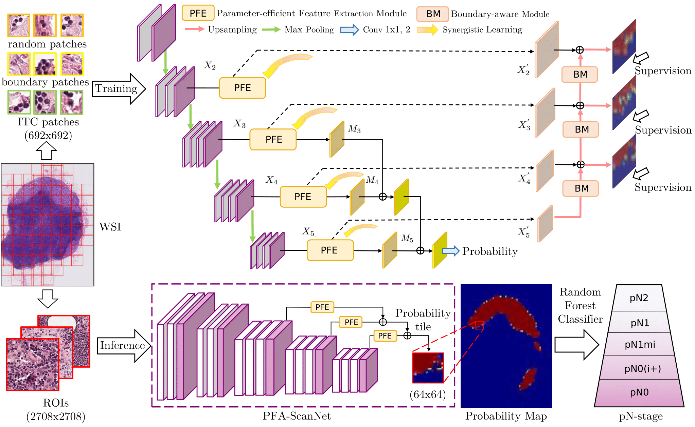
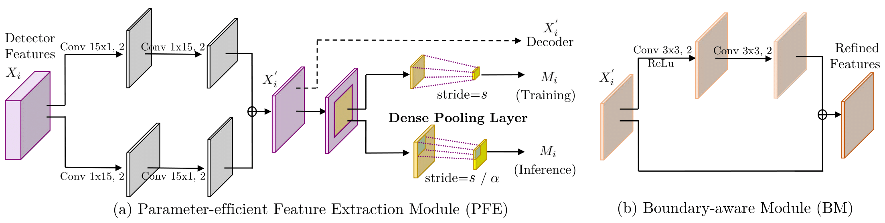

# PFA-ScanNet

PFA-ScanNet: *Pyramidal Feature Aggregation with Synergistic Learning for Breast Cancer Metastasis Analysis.* [[paper]](https://arxiv.org/abs/1905.01040)

## Abstract

Automatic detection of cancer metastasis from whole slide images (WSIs) is a crucial step for following patient staging and prognosis. Recent convolutional neural network based approaches are struggling with the trade-off between accuracy and computational efficiency due to the difficulty in processing large-scale gigapixel WSIs. To meet this challenge, we propose a novel Pyramidal Feature Aggregation ScanNet (PFA-ScanNet) for robust and fast analysis of breast cancer metastasis. Our method mainly benefits from the aggregation of extracted local-to-global features with diverse receptive fields, as well as the proposed synergistic learning for training the main detector and extra decoder with semantic guidance. Furthermore, a high-efficiency inference mechanism is designed with dense pooling layers, which allows dense and fast scanning for gigapixel WSI analysis. As a result, the proposed PFA-ScanNet achieved the state-of-the-art FROC of 90.2% on the Camelyon16 dataset, as well as competitive kappa score of 0.905 on the Camelyon17 leaderboard. In addition, our method shows leading speed advantage over other methods, about 7.2 min per WSI with a single GPU, making automatic analysis of breast cancer metastasis more applicable in the clinical usage.

